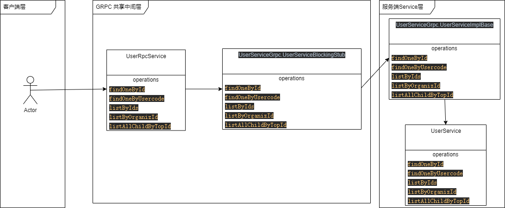

# GRPC使用说明


## 依赖配置
### 插件配置
    请看(../pom.xml)文件中的protobuf-maven-plugin插件
### 依赖配置（举例说明）
    anan-platformserver是GRPC的Server端，依赖了grpc-server-spring-boot-starter
    anan-cloudresource是GRPC的中间层依赖端，依赖了grpc-client-spring-boot-starter
    anan-cloudgateway是GRPC的客户端，通过依赖anan-cloudresource间接依赖了grpc-client-spring-boot-starter
### 系统配置
```yaml
    #这里是列出必要参数，其他设置根据需求设置
    grpc:
      client:
        GLOBAL:
          #不使用TLS方式访问，不启用否则需要启用https
          negotiation-type: plaintext
      server:
        #是否启动保持连接（默认false），服务端可以开启保持会话
        enableKeepAlive: true
```
## proto文件使用说明
### protobuf使用说明
    <https://protobuf.dev/programming-guides/proto3/>
    
### proto文件存放目录
    目前存放在(../anan-cloudresource/src/main/proto/)目录下，也可以在插件中设置指定目录。
### 将proto文件转成Java类
```shell
    #生成实体类
    mvn protobuf:complie
    #生成GRPC入口类
    mvn protobuf:complie-custom
```
## 代码调用
### 调用流程图

### 支持的服务清单
[机构类OrganizGrpcServiceImpl.java](..%2Fanan-cloudresource%2Fsrc%2Fmain%2Fjava%2Ftop%2Ffosin%2Fanan%2Fcloudresource%2Fgrpc%2Fservice%2FOrganizGrpcServiceImpl.java)

[参数类ParameterGrpcServiceImpl.java](..%2Fanan-cloudresource%2Fsrc%2Fmain%2Fjava%2Ftop%2Ffosin%2Fanan%2Fcloudresource%2Fgrpc%2Fservice%2FParameterGrpcServiceImpl.java)

[用户类UserGrpcServiceImpl.java](..%2Fanan-cloudresource%2Fsrc%2Fmain%2Fjava%2Ftop%2Ffosin%2Fanan%2Fcloudresource%2Fgrpc%2Fservice%2FUserGrpcServiceImpl.java)

参数类比较特殊，做了特殊处理，分别支持3种情况

[机构参数类RemoteOrganParameter.java](..%2Fanan-cloudresource%2Fsrc%2Fmain%2Fjava%2Ftop%2Ffosin%2Fanan%2Fcloudresource%2Fparameter%2FRemoteOrganParameter.java)

[服务参数类RemoteServiceParameter.java](..%2Fanan-cloudresource%2Fsrc%2Fmain%2Fjava%2Ftop%2Ffosin%2Fanan%2Fcloudresource%2Fparameter%2FRemoteServiceParameter.java)

[用户参数类RemoteUserParameter.java](..%2Fanan-cloudresource%2Fsrc%2Fmain%2Fjava%2Ftop%2Ffosin%2Fanan%2Fcloudresource%2Fparameter%2FRemoteUserParameter.java)
### 调用代码示例
```java
public class RemoteParameter implements IParameter {
    
    private final ParameterRpcService parameterRpcService;

    //注入Spring Bean
    public RemoteParameter(ParameterRpcService parameterRpcService) {
        this.parameterRpcService = parameterRpcService;
    }
    //直接调用服务中的方法获取返回值使用即可
    public String getOrCreateParameter(String scope, String name, String defaultValue, String description) {
        return parameterRpcService.getOrCreateParameter(this.getParameterStrategy().getType(), scope, name, defaultValue, description);
    }
}

```

## 使用资料请看


### 2、Java对应框架Grpc-Spring-Boot-Starter使用说明
    https://yidongnan.github.io/grpc-spring-boot-starter/zh-CN/