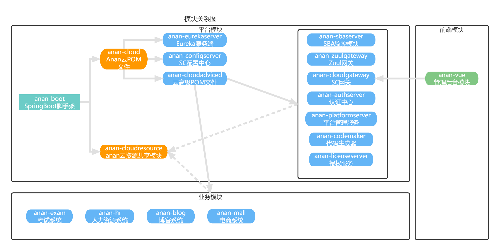

# 设计定位
    经过几个月，内部大重构的3.0来了，对外功能无变化，使用更强、更快、更好用了！！！

    第一步：正式启用anan-cloudgateway网关模块（基于Reactive的WebFlux技术栈），原网关项目anan-zuulgateway不再支持，Servlet和Reactive两种模式并行使用。（已完成）
    第二步：逐步将剩余模块从Servlet技术栈迁移至Reactive技术栈。（进行中）

    anan基于JDK11、Spring Boot 2.5.x、Spring Cloud 2020生态体系技术，采用微服务前后端分离架构，供开发人员学习和交流。
    包括服务注册与发现、服务监控、服务管理、服务治理、服务网关、服务熔断、配置管理、OAuth2认证授权中心等常见微服务组件。
    服务注册与发现：支持nacos、eureka；
    配置中心：支持Nacos、SpringCloudConfig；
    部署方式：支持Kubernetes(Helm)集群部署、jar包集群部署、Docker-Compose部署、Swarm集群部署

对应前端项目地址: <https://github.com/fosin/anan-vue>

## 技术选型

     技术                                   |           简介 
    ------                                 |          ------
    Anan-Boot                              | anan-boot-starter基础构建框架脚手架，基于SpringBoot2.3
        anan-core                          | 公共核心、工具类
        anan-security                      | 快速搭建基于Spring Security、Oauth2的授权服务器、资源服务器认证体系
        anan-jpa                           | 快速构建基于Spring Data Jpa的CRUD、分页、排序、树形数据
        anan-mybatis                       | 快速构建基于MybatisPlus的CRUD、分页、排序、树形数据
        anan-swagger                       | 快速构建基于Swagger3.0的API文档
    Spring MVC                             | MVC分层框架 
    Spring Webflux                         | Reactive框架技术栈
    Alibaba Nacos(备选Eureka)               | 服务注册中心 
    Alibaba Nacos(备选Config)               | 配置管理中心 
    Alibaba Sentinel                       | 服务限流、熔断框架 
    Spring Cloud Gateway                   | 服务网关 
    Spring Cloud OpenFeign                 | 微服务声明式调用框架 
    Spring Cloud Sleuth Zipkin             | 分布式链路追踪
    Spring Boot Admin                      | 服务管理中心 
    Spring Data Redis                      | 缓存框架 
    OAuth2 Authorization Server            | 单点登录、鉴权、认证框架
    Slf4j Log4j2 Logback                   | 日志框架
    Spring Validator                       | 后端验证框架 
    Hibernate Validator                    | Hibernate验证框架 
    lombok                                 | 一个通过注解自动生成get/set方法的类库 
    Thymeleaf                              | HTML5模板引擎  
    Maven                                  | 项目构建管理  
    Redis                                  | 缓存内存数据库 
    Mysql                                  | 对象关系数据库 
    RabbitMQ                               | 消息中间件
    ELK                                    | 日志收集、分析组合框架
    Promethus、Grafana等                    | 智能监控运维框架
    Vuejs、Nodejs、Webpack、ElementUI       | 前段开发框架
## 架构设计

### 系统架构图

### 网络拓扑图

### 模块关系图

### 功能设计图

## 框架版本对照

    anan-cloud    |     anan-boot     |      anan-vue
    -------------------------------------------------------
    1.0.x               1.0.x                1.0.0         
    2.0.x               2.0.x                2.0.0         
    2.2.x               2.0.x                3.3.x
    2.3.x               2.1.x                3.3.x
    2.4.x               2.1.x                3.4.x
    2.5.x               2.2.x                3.4.x
    2.6.x               2.3.x                3.4.x
    2.7.x               2.4.x                3.5.x
    3.0.x               3.0.x                3.5.x

## 搭建环境

## 1、本地（profile=local）开发环境指南

### 1.1、安装docker、docker-compose

#### 1.1.1、安装docker

详细介绍 [点这里deploy/readme-docker.md](deploy/readme-docker.md)

#### 1.1.2、安装docker-compose并搭建开放环境

详细介绍 [点这里deploy/readme-docker-compose.md](deploy/readme-docker-compose.md)

### 1.2、运行前端项目anan-vue

详细介绍移步<https://github.com/fosin/anan-vue>查看前端项目的开发环境搭建过程

## 2、部署生产环境指南

### 2.1、Kubernetes部署(helm)

详细介绍 [点这里readme-helm.md](deploy/helm/readme-helm.md)

### 2.2、jar包部署

详细介绍 [点这里readme-jar.md](deploy/jar/readme-jar.md)

### 2.3、Docker Compose环境部署

详细介绍 [点这里readme-docker-compose.md](deploy/readme-docker-compose.md)

### 2.4、Docker Swarm集群环境部署

详细介绍 [点这里readme-swarm.md](deploy/swarm/readme-swarm.md)

## 码农不易，打赏作者一杯茶吧

